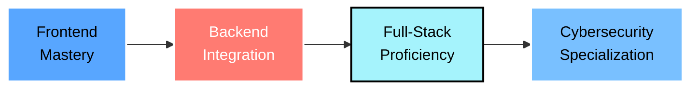
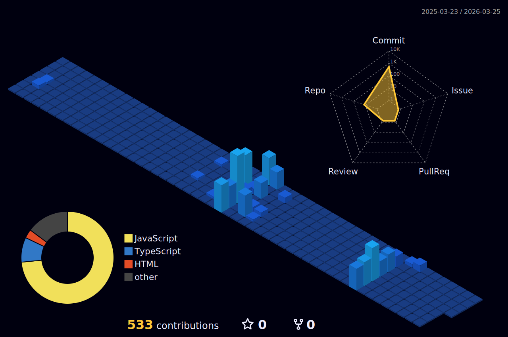

<h1 align=center> Hi there  I'm Teytann!  </h1>

<!-- Enhanced Profile Header Widget -->
<div align="center">
  
</div>

<!-- the main gif-->
<table align=center>
  <tr>
    <td width=800px>
</td>
  </tr>
</table>

<p align="center">
  <a href="https://git.io/typing-svg">
    
  </a>
</p>

<div align="center">
  
</div>

<br> <br>
---

---
<br> <br>


<h1 align="center">
  
  🚀 About Me
  
</h1>

<div align="center">
  
```ascii
╔════════════════════════════════════════════════════════════════════╗
║                                                                    ║
║   ██████╗ ███████╗██╗   ██╗    ██████╗ ██████╗  ██████╗ ███████╗  ║
║   ██╔══██╗██╔════╝██║   ██║    ██╔══██╗██╔══██╗██╔═══██╗██╔════╝  ║
║   ██║  ██║█████╗  ██║   ██║    ██████╔╝██████╔╝██║   ██║█████╗    ║
║   ██║  ██║██╔══╝  ╚██╗ ██╔╝    ██╔═══╝ ██╔══██╗██║   ██║██╔══╝    ║
║   ██████╔╝███████╗ ╚████╔╝     ██║     ██║  ██║╚██████╔╝██║       ║
║   ╚═════╝ ╚══════╝  ╚═══╝      ╚═╝     ╚═╝  ╚═╝ ╚═════╝ ╚═╝       ║
║                                                                    ║
╚════════════════════════════════════════════════════════════════════╝
```

</div>

<br>

<table width="100%">
<tr>
<td width="50%" valign="top">

<div align="center">

### 💻 **Developer & Problem Solver**


</div>

Building comprehensive technical skills across the full development spectrum. Passionate about creating user-centric applications while understanding the complete system architecture from frontend to backend and beyond.

<br>

<div align="center">

### 🎯 **Featured Projects**

</div>

🏥 **Hospital Management System**  
*Streamlining medical resource tracking and waste reduction*

🏠 **House Rules App**  
*Production-ready application on Firebase infrastructure*

🚀 **Profile Widgets**  
*Dynamic SVG generators for GitHub profiles*

<br>

<div align="center">

### 📈 **Development Roadmap**



</div>

<br>

<div align="center">

### ⚡ **Learning Philosophy**

  
⬇️  
  
⬇️  


</div>

</td>
<td width="50%" valign="top">

<div align="center">


<br><br>

### 🎨 **Beyond Code**


Merging technical precision with creative vision to build meaningful digital experiences.

<br><br>

### ⚡ **Work Ethic**

```javascript
const developer = {
  schedule: "Early morning starter",
  mindset: "Detail-oriented",
  growth: "Continuous learner",
  approach: "Systems thinker",
  
  dailyRoutine: function() {
    while(true) {
      this.learn();
      this.build();
      this.improve();
    }
  }
};
```

<br>

### 🌍 **Long-Term Vision**


Working toward building secure, accessible, and privacy-respecting digital infrastructure.

<br><br>

### 📖 **Guiding Principle**

<div align="center">

*"المرء على دين خليله فلينظر أحدكم من يخالل"*

**"A person follows the character of their friend,  
so let each look carefully at whom they befriend."**

</div>

</div>

</td>
</tr>
</table>

<br>

<div align="center">


</div>

<br> <br>
---

---

<h1 align=center > Tech Stack  </h1>

<p align="center">
   
  
  
  
  
  
  
  
  
  
  
  
  
  
</p>

<div align="center">
  
  
  
</div>


<br> <br>
---
---
<br> <br>


<h1 align=center>  GitHub Stats  </h1>

<div align="center">

<table width="100%">
<tr>
<td width="35%">

</td>
<td width="65%">


</td>
</tr>
</table>

<div align="center">
  
  
</div>

<br>


</div>



<br> <br>
---
---
<br> <br>


<h1 align=center>Daily Quote</h1>
<div align=center>
  


</div>

<h1 align=center>💫 Random Dev Quote</h1>

<div align="center">
  
</div>

<!-- Monokai - Dark with subtle colors -->
<div align="center">
  
</div>

<!-- Dracula - Popular dark theme with purple accents -->
<div align="center">
  
</div>

<!-- Gruvbox Dark - Warm, retro dark theme -->
<div align="center">
  
</div>

<!-- Dark - Simple, clean dark theme -->
<div align="center">
  
</div>

<!-- Nord - Cool, bluish dark theme -->
<div align="center">
  
</div>


<br> <br>
---


---
<br> <br>


<h1 align=center>  Contribution Games</h1>


<h3 align=center>🕹️ Pac-Man Contributions</h3>
<picture>
  <source 
    media="(prefers-color-scheme: dark)" 
    srcset="https://raw.githubusercontent.com/abozanona/abozanona/output/pacman-contribution-graph-dark.svg" 
  />
  <source 
    media="(prefers-color-scheme: light)" 
    srcset="https://raw.githubusercontent.com/abozanona/abozanona/output/pacman-contribution-graph.svg" 
  />
  
</picture>

<h3 align=center>🐍 GitHub Snake Game</h3>
<picture>
  <source
    media="(prefers-color-scheme: dark)"
    srcset="https://raw.githubusercontent.com/platane/snk/output/github-contribution-grid-snake-dark.svg"
  />
  <source
    media="(prefers-color-scheme: light)"
    srcset="https://raw.githubusercontent.com/platane/snk/output/github-contribution-grid-snake.svg"
  />
  
</picture>

</div>


<br> <br>
---
---
<br> <br>


<h1 align=center>🏆 Achievements & Trophies</h1>

<div align="center">
  
</div>

<br> <br> <br>

---

<br> <br>

<div align="center">

#  Connect With Me 

  <h3>Let's build something amazing together! 🚀</h3>
  
  <br>
  
  <!-- Animated Contact Links -->
  <a href="https://discord.com/users/Teytann" target="_blank">
    
  </a>
  &nbsp;&nbsp;&nbsp;
  <a href="mailto:teytannz@gmail.com">
    
  </a>
  &nbsp;&nbsp;&nbsp;
  <a href="www.linkedin.com/in/z-ahmed-555239368" target="_blank">
    
  </a>
  &nbsp;&nbsp;&nbsp;
  <a href="https://github.com/TeytannZ" target="_blank">
    
  </a>
  
  <br><br>
  
  <!-- Profile Views -->
  

</div>

<br> <br> <br>

---

<br> <br>

<div align="center">

  <h1>💖 Thanks for visiting! 💖</h1>
  
  <h3><i>⚡ "Code is poetry written in logic" ⚡</i></h3>
  

</div>

<br> <br> <br>

---
