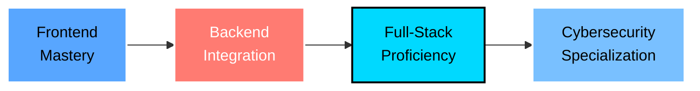
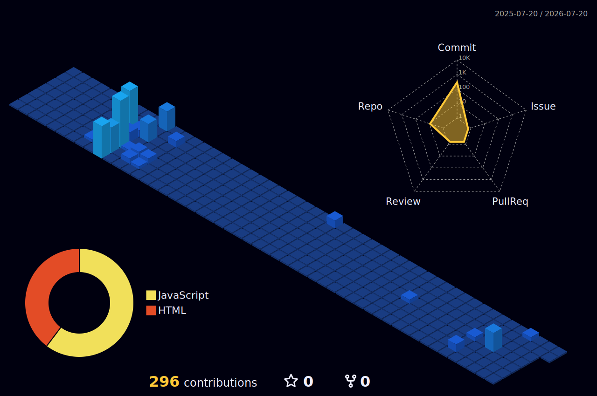

<h1 align="center">
  Hi there  &nbsp; I'm Teytann! &nbsp; 
</h1>

<div align="center">
  
</div>

<!-- Main profile GIF -->
<table align="center">
  <tr>
    <td width="800px"></td>
  </tr>
</table>

<p align="center">
  <a href="https://git.io/typing-svg">
    
  </a>
</p>

<div align="center">
  
</div>

<br><br>


<br><br>


<h1 align="center">
  
  &nbsp;🚀 About Me&nbsp;
  
</h1>

<div align="center">

</div>

<br>

<table width="100%">
<tr>
<td width="50%" valign="top">

<div align="center">

### 💻 **Full-Stack Developer · CS Graduate**


</div>

Freshly graduated, building comprehensive technical skills across the full development spectrum. Passionate about creating user-centric applications with a strong understanding of system architecture — from frontend to backend and beyond.

<br>

<div align="center">

### 🎯 **Featured Projects**

</div>

🏥 **Hospital Management System**  
*Streamlining medical resource tracking and waste reduction*

🏠 **House Rules App**  
*Production-ready application on Firebase infrastructure*

🚀 **Profile Widgets** ← *powers this profile!*  
*Dynamic SVG widget generators for GitHub profiles*

<br>

<div align="center">

### 📈 **Development Roadmap**


```mermaid
graph LR
    A[Frontend<br/>Mastery] --> B[Backend<br/>Integration]
    B --> C[Full-Stack<br/>Proficiency]
    C --> D[Cybersecurity<br/>Specialization]

    style A fill:#58a6ff,stroke:#fff,stroke-width:2px,color:#000
    style B fill:#ff7b72,stroke:#fff,stroke-width:2px,color:#fff
    style C fill:#00d9ff,stroke:#000,stroke-width:2px,color:#000
    style D fill:#79c0ff,stroke:#fff,stroke-width:2px,color:#000
```

</div>

<br>

<div align="center">

### ⚡ **Learning Philosophy**

  
⬇️  
  
⬇️  


</div>

</td>
<td width="50%" valign="top">

<div align="center">


<br><br>

### 🎨 **Beyond Code**


Merging technical precision with creative vision to build meaningful digital experiences.

<br><br>

### ⚡ **Work Ethic**

```typescript
const developer: Developer = {
  name:       "TeytannZ",
  status:     "CS Graduate · Job Hunting 🎯",
  schedule:   "Night owl — 1AM to 4AM ⚡",
  mindset:    "Detail-oriented perfectionist",
  approach:   "Systems thinker · builder",
  dailyReset: "Sahih Bukhari & Muslim 🌙",

  dailyRoutine(): void {
    while (true) {
      this.learn();
      this.build();
      this.improve();
    }
  }
};
```

<br>

### 🌍 **Long-Term Vision**


Working toward building secure, accessible, and privacy-respecting digital infrastructure.

<br><br>

### 📖 **Guiding Principle**

*"المرء على دين خليله فلينظر أحدكم من يخالل"*

**"A person follows the character of their friend,  
so let each look carefully at whom they befriend."**

</div>

</td>
</tr>
</table>

<br>

<div align="center">


</div>

<br><br>


<br><br>


<h1 align="center">
   Tech Stack
  
</h1>

<p align="center">
  
  
  
  
  
  
  
  
  
  
  
  
  
  
  
  
  
  
</p>

<div align="center">


</div>

<br><br>


<br><br>


<h1 align="center">
   GitHub Stats
  
</h1>

<div align="center">

<table width="100%">
<tr>
<td width="35%">

</td>
<td width="65%">


</td>
</tr>
</table>

<div align="center">
  
  
</div>

<br>



</div>

<br><br>


<br><br>


<h1 align="center">
   Contribution Games
</h1>

<h3 align="center">🕹️ Pac-Man Contributions</h3>
<picture>
  <source
    media="(prefers-color-scheme: dark)"
    srcset="https://raw.githubusercontent.com/TeytannZ/TeytannZ/output-pacman/pacman-contribution-graph-dark.svg"
  />
  <source
    media="(prefers-color-scheme: light)"
    srcset="https://raw.githubusercontent.com/TeytannZ/TeytannZ/output-pacman/pacman-contribution-graph.svg"
  />
  
</picture>

<h3 align="center">🐍 GitHub Snake</h3>
<picture>
  <source
    media="(prefers-color-scheme: dark)"
    srcset="https://raw.githubusercontent.com/TeytannZ/TeytannZ/output/github-contribution-grid-snake-dark.svg"
  />
  <source
    media="(prefers-color-scheme: light)"
    srcset="https://raw.githubusercontent.com/TeytannZ/TeytannZ/output/github-contribution-grid-snake.svg"
  />
  
</picture>

<br><br>


<br><br>


<h1 align="center">🏆 Achievements & Trophies</h1>

<div align="center">
  
</div>

<br><br>


<br><br>


<h1 align="center">
   Hadith of the Day
  
</h1>

<div align="center">
  <sub>Authentic narrations from Sahih al-Bukhari & Sahih Muslim only · rotated daily by GitHub Actions</sub>
</div>

<br>

<!-- HADITH_START -->
<div align="center">


<br><br>

*أَحَبُّ الأَعْمَالِ إِلَى اللَّهِ أَدْوَمُهَا وَإِنْ قَلَّ*

<br>

> **"The most beloved deeds to Allah are those done consistently, even if they are few."**
>
> — Prophet Muhammad ﷺ

</div>
<!-- HADITH_END -->

<br><br>


<br><br>


<h1 align="center">🐾 Contribution Companions</h1>

<div align="center">
  <a href="https://gitanimals.org" target="_blank">
    
  </a>
  <br>
  <a href="https://gitanimals.org" target="_blank">
    
  </a>
</div>

<br><br>


<br><br>


<div align="center">

#  Connect With Me 

<h3>Let's build something amazing together! 🚀</h3>

<br>

<!-- Live Discord presence — replace YOUR_DISCORD_ID with your numeric Discord user ID -->
<!-- Get it: Discord Settings → Advanced → Developer Mode ON → right-click your name → Copy User ID -->
<a href="https://discord.com/users/YOUR_DISCORD_ID" target="_blank">
  
</a>

<br><br>

<!-- Animated Contact Links -->
<a href="https://discord.com/users/YOUR_DISCORD_ID" target="_blank">
  
</a>
&nbsp;&nbsp;&nbsp;
<a href="mailto:teytannz@gmail.com">
  
</a>
&nbsp;&nbsp;&nbsp;
<a href="https://www.linkedin.com/in/z-ahmed-555239368" target="_blank">
  
</a>
&nbsp;&nbsp;&nbsp;
<a href="https://github.com/TeytannZ" target="_blank">
  
</a>

<br><br>


</div>

<br><br><br>

---

<br><br>

<div align="center">

  <h1>💖 Thanks for visiting! 💖</h1>
  
  <h3><i>⚡ "Code is poetry written in logic" ⚡</i></h3>
  

</div>

<br><br>


