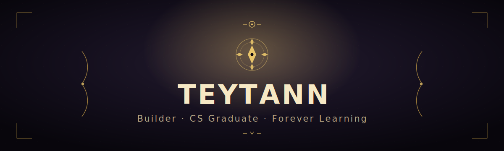

 

 

## 🔧 About

I like fixing and building things — physical or digital, doesn't matter. Right now I'm relearning the fundamentals properly: actually understanding the code I write, not just directing AI to produce it for me.

 

## ⚒️ Skills

<table width="100%">
<tr>
<td align="center" width="50%">

**Comfortable with**

</td>
<td align="center" width="50%">

**Currently learning → next up**

</td>
</tr>
</table>

 

## 🗺️ Roadmap

| Phase | Focus | Status |
|---|---|---|
| **1 · Foundations** | How the Web Works · Git & GitHub · HTML/CSS · Flexbox & Grid · Responsive Design · JS Fundamentals | 🔄 In Progress |
| **2 · Frontend** | Tailwind · React · React Router & Context · Hooks · TypeScript | ⏳ Next |
| **3 · Backend** | Node.js · Express · SQL · PostgreSQL · JWT Auth | ⏳ Planned |
| **4 · Deployment+** | Deployment · Socket.io · LLM APIs | ⏳ Planned |
| **Side Quest** | Godot / GDScript — tutorial game extended with my own mechanics | 🔄 In Progress |

 

## 🏰 Featured Project

<table width="100%">
<tr>
<td width="100%">

### [Ardenmoor](https://github.com/TeytannZ/ardenmoor)
Dark fantasy RPG learning app — my final-year project. Full custom visual identity, React/Vite/Supabase stack.

</td>
</tr>
</table>

 

## 📊 GitHub Stats

 

## 📖 Hadith of the Day

Authentic narrations from Sahih al-Bukhari & Sahih Muslim only · rotated daily by GitHub Actions

<!-- HADITH_START -->

  

*أَحَبُّ الأَعْمَالِ إِلَى اللَّهِ أَدْوَمُهَا وَإِنْ قَلَّ*

 

> **"The most beloved deeds to Allah are those done consistently, even if they are few."**
>
> — Prophet Muhammad ﷺ

<!-- HADITH_END -->

 

## 📬 Contact

📧 [teytannz@gmail.com](mailto:teytannz@gmail.com)

