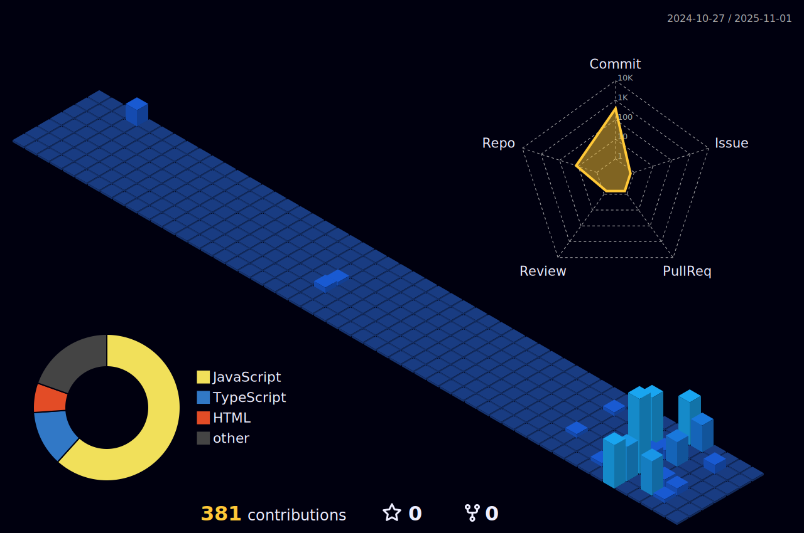

# Hi there  I'm Teytann! 

  

<!-- the main gif-->

---

## 🚀 About Me

<table width="100%">
<tr>
<td width="50%">

 <b>Self-learner & Solo Coder:</b> Computer Science Student

 <b>Focus:</b> Web Development, improving my <b>JavaScript</b> skills daily

 <b>Hobbies:</b> Painting, drawing, and exploring creative coding

 <b>Goal:</b> Build cool web projects while learning and growing

 <b>Location:</b> Planet Earth 🌍

 Always curious. Always learning. Always creating.

</td>
<td width="50%">

### 🎮 Fun Facts
- 🌅 Early bird programmer
- 🥤 Hydration-powered coding sessions
- 🎨 Adding visual flair to projects
- 🔥 Love experimenting with new tech
- 💻 Solo coding adventures

</td>
</tr>
</table>

---

## Tech Stack 

  
  ### 💻 Frontend Technologies
  
  
  
  
  
  
  
  ### 🛠️ Development Tools
  
  
  
  
  ### 🗄️ Databases (Learning)
  
  

---

##  GitHub Stats 

<table width="100%">
<tr>
<td width="35%">

</td>
<td width="65%">

</td>
</tr>
</table>

  
  

 

  

---

##  Featured Projects

### 🚧 Coming Soon... 🚧
*Currently working on awesome projects that will blow your mind!*

---

##  Contribution Games

## 🎯 GitHub Contribution 3D Graph

### 🕹️ Pac-Man Contributions
<picture>
  <source 
    media="(prefers-color-scheme: dark)" 
    srcset="https://raw.githubusercontent.com/abozanona/abozanona/output/pacman-contribution-graph-dark.svg" 
  />
  <source 
    media="(prefers-color-scheme: light)" 
    srcset="https://raw.githubusercontent.com/abozanona/abozanona/output/pacman-contribution-graph.svg" 
  />
  
</picture>

### 🐍 GitHub Snake Game
<picture>
  <source
    media="(prefers-color-scheme: dark)"
    srcset="https://raw.githubusercontent.com/platane/snk/output/github-contribution-grid-snake-dark.svg"
  />
  <source
    media="(prefers-color-scheme: light)"
    srcset="https://raw.githubusercontent.com/platane/snk/output/github-contribution-grid-snake.svg"
  />
  
</picture>

<table>
  <tr>
    <td width=1000px></td>
  </tr>
</table>

---

## 🏆 Achievements & Trophies

  

---

## 💫 Random Dev Quote

  

---

## 🔥 Languages & Frameworks

  
  
    

  

---

##  Connect With Me

  <h3>Let's build something amazing together! 🚀</h3>
  
  
  
  
  

    

    
  
  
  
  

    
  

---

## 🎨 Fun Animations

  
  
  
  
  
  

---

  

<h3>💖 Thanks for visiting! 💖</h3>

<i>⚡ "Code is poetry written in logic" ⚡</i>

